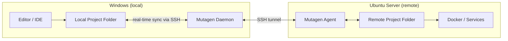

# Mutagen — real-time file synchronization (Windows ↔ Ubuntu)

Mutagen — утилита для непрерывной двусторонней синхронизации файлов между локальной машиной и удалённым сервером через SSH. Работает в реальном времени, отслеживая изменения файловой системы. Не требует установки на удалённый сервер — агент копируется автоматически.

## Overview



## Quick reference

| Command | Description |
| --- | --- |
| `mutagen sync create` | Create a new sync session |
| `mutagen sync list` | List all sessions and their status |
| `mutagen sync monitor <name>` | Live monitoring of a session |
| `mutagen sync pause <name>` | Pause synchronization |
| `mutagen sync resume <name>` | Resume synchronization |
| `mutagen sync flush <name>` | Force a sync cycle |
| `mutagen sync reset <name>` | Reset session history |
| `mutagen sync terminate <name>` | Delete a session |
| `mutagen daemon start` | Start the background daemon |
| `mutagen daemon stop` | Stop the daemon |

## Synchronization modes

| Mode | Direction | Conflicts |
| --- | --- | --- |
| `two-way-safe` (default) | Bidirectional | Conflicts saved, no data loss |
| `two-way-resolved` | Bidirectional | Alpha wins all conflicts |
| `one-way-safe` | Alpha → Beta | Beta changes preserved if no conflict |
| `one-way-replica` | Alpha → Beta | Beta is exact replica of Alpha |

For bidirectional dev sync, use the default `two-way-safe`.

---

## 1. Install Mutagen on Windows

Download the latest release from GitHub:

```powershell
# Option 1: Download and extract manually
# https://github.com/mutagen-io/mutagen/releases/latest
# Download mutagen_windows_amd64_v0.18.1.zip (or latest)
# Extract to a folder and add to PATH

# Option 2: Using winget (if available)
winget install mutagen-io.mutagen

# Option 3: Using Scoop
scoop bucket add mutagen https://github.com/mutagen-io/scoop-mutagen
scoop install mutagen
```

Verify installation:

```powershell
mutagen version
# Expected: 0.18.x or later

# Start the daemon
mutagen daemon start
```

> **Note**: Mutagen does NOT need to be installed on the remote server. It automatically copies a lightweight agent binary via SSH on first connection.

## 2. Configure SSH access to Ubuntu server

Mutagen uses OpenSSH under the hood, so all SSH configs, keys, and aliases are available.

### 2.1. Generate SSH key (if not exists)

```powershell
# Check existing keys
Get-ChildItem ~/.ssh/id_ed25519*

# Generate new key if needed
ssh-keygen -t ed25519 -C "mutagen-sync"
```

### 2.2. Copy public key to server

```powershell
# Copy key to the remote server
type $env:USERPROFILE\.ssh\id_ed25519.pub | ssh user@server.example.com "mkdir -p ~/.ssh && cat >> ~/.ssh/authorized_keys"
```

### 2.3. Configure SSH alias (recommended)

Add to `~/.ssh/config`:

```
Host myserver
    HostName server.example.com
    User user
    Port 22
    IdentityFile ~/.ssh/id_ed25519
    ServerAliveInterval 60
    ServerAliveCountMax 3
```

Test connection:

```powershell
ssh myserver "echo 'SSH connection OK'"
```

## 3. Create a sync session

### 3.1. Basic sync (single project)

```powershell
# Syntax: mutagen sync create [flags] <alpha> <beta>
# Alpha = first endpoint, Beta = second endpoint

mutagen sync create --name=my-project `
    ~/Projects/my-project `
    myserver:~/projects/my-project
```

On Windows, use forward slashes or full paths:

```powershell
mutagen sync create --name=my-project `
    C:/Projects/my-project `
    myserver:~/projects/my-project
```

### 3.2. Sync with ignore patterns

```powershell
mutagen sync create --name=my-project `
    --ignore-vcs `
    --ignore="node_modules/" `
    --ignore=".env" `
    --ignore="tmp/" `
    --ignore="__pycache__/" `
    --ignore="*.mp4" `
    --ignore="*.log" `
    --ignore=".venv/" `
    C:/Projects/my-project `
    myserver:~/projects/my-project
```

### 3.3. Sync a Docker project (n8n example)

```powershell
mutagen sync create --name=n8n-hub `
    --ignore-vcs `
    --ignore="*.log" `
    --ignore="database/" `
    --ignore="secrets/" `
    C:/Projects/telegram-ai-hub `
    myserver:~/apps/telegram-ai-hub
```

## 4. Global configuration (~/.mutagen.yml)

Create `~/.mutagen.yml` on the Windows machine for default settings:

```yaml
sync:
  defaults:
    mode: "two-way-safe"
    ignore:
      vcs: true
      paths:
        # OS files
        - ".DS_Store"
        - "Thumbs.db"
        - "desktop.ini"

        # IDE / Editor
        - ".idea/"
        - ".vscode/"
        - "*.swp"
        - "*.swo"
        - "*~"

        # Runtime / Build
        - "node_modules/"
        - "__pycache__/"
        - ".venv/"
        - "*.pyc"
        - ".pytest_cache/"

        # Docker data (should not be synced)
        - "*.log"

    permissions:
      defaultFileMode: "0644"
      defaultDirectoryMode: "0755"
```

> **Important**: Global ignores are locked into each session at creation time. Changes to `~/.mutagen.yml` only apply to new sessions.

## 5. Project file (mutagen.yml)

For project-level orchestration, create `mutagen.yml` in the project root:

```yaml
# mutagen.yml — place in the project root directory

beforeCreate:
  - echo "Starting sync for telegram-ai-hub..."

sync:
  defaults:
    mode: "two-way-safe"
    ignore:
      vcs: true
      paths:
        - "*.log"
        - "secrets/"
        - "database/"

  app-code:
    alpha: "."
    beta: "myserver:~/apps/telegram-ai-hub"
    flushOnCreate: true
    ignore:
      paths:
        - "node_modules/"

commands:
  ssh: "ssh myserver"
  logs: "ssh myserver 'cd ~/apps/telegram-ai-hub && docker compose logs -f'"
  restart: "ssh myserver 'cd ~/apps/telegram-ai-hub && docker compose restart'"
```

Usage:

```powershell
# Start all sessions defined in mutagen.yml
cd C:\Projects\telegram-ai-hub
mutagen project start

# Run custom commands
mutagen project run ssh
mutagen project run logs

# Stop all sessions
mutagen project terminate
```

## 6. Prepare Ubuntu server

The server side requires minimal setup — Mutagen handles agent deployment automatically. Just ensure the prerequisites:

```bash
# 1. Ensure SSH server is running
sudo systemctl status sshd

# 2. Create project directory
mkdir -p ~/projects/my-project

# 3. Verify firewall allows SSH
sudo ufw status
sudo ufw allow OpenSSH

# 4. (Optional) Adjust inotify limits for large projects
# Check current limit
cat /proc/sys/fs/inotify/max_user_watches

# Increase if needed (default 8192 may be too low)
echo "fs.inotify.max_user_watches=524288" | sudo tee -a /etc/sysctl.conf
sudo sysctl -p
```

## 7. Session management

### Check status

```powershell
# List all sessions
mutagen sync list

# Detailed output
mutagen sync list -l

# Live monitoring
mutagen sync monitor my-project
```

### Pause / Resume

```powershell
# Pause (stops watching for changes)
mutagen sync pause my-project

# Resume
mutagen sync resume my-project
```

### Handle conflicts

In `two-way-safe` mode, conflicts are recorded but not auto-resolved:

```powershell
# Check for conflicts
mutagen sync list my-project

# Resolve: delete the losing side's version, then flush
mutagen sync flush my-project

# Nuclear option: reset session history (treats current state as fresh)
mutagen sync reset my-project
```

### Terminate

```powershell
# Remove a session (does NOT delete files)
mutagen sync terminate my-project

# Remove all sessions
mutagen sync terminate --all
```

## 8. Autostart on Windows

### Option A: Startup shortcut

Create a `.bat` file in `shell:startup`:

```batch
@echo off
mutagen daemon start
mutagen sync resume --all 2>nul
```

### Option B: Scheduled task (PowerShell)

```powershell
$action = New-ScheduledTaskAction -Execute "mutagen" -Argument "daemon start"
$trigger = New-ScheduledTaskTrigger -AtLogOn
$principal = New-ScheduledTaskPrincipal -UserId $env:USERNAME -RunLevel Limited
Register-ScheduledTask -TaskName "MutagenDaemon" -Action $action -Trigger $trigger -Principal $principal
```

## 9. Practical examples

### Multiple projects

```powershell
# Project 1: telegram-ai-hub (configs + workflows)
mutagen sync create --name=telegram-hub `
    --ignore-vcs `
    --ignore="secrets/" --ignore="database/" --ignore="*.log" `
    C:/Projects/telegram-ai-hub `
    myserver:~/apps/telegram-ai-hub

# Project 2: n8n workflows only
mutagen sync create --name=n8n-workflows `
    --ignore-vcs `
    C:/Projects/n8n-chat-moderator/workflows `
    myserver:~/apps/n8n-moderator/workflows

# Project 3: Infrastructure configs
mutagen sync create --name=infra-configs `
    --ignore-vcs `
    --mode=one-way-replica `
    C:/Projects/ai-lab-server-setup/config `
    myserver:~/infra/config
```

### One-way deploy (local → server)

```powershell
# Push-only: server becomes exact replica
mutagen sync create --name=deploy-prod `
    --mode=one-way-replica `
    --ignore-vcs `
    --ignore="*.env" --ignore="secrets/" `
    C:/Projects/my-app `
    prod-server:~/apps/my-app
```

## 10. Troubleshooting

| Problem | Solution |
| --- | --- |
| Session stuck on "Connecting" | Check SSH: `ssh myserver` — must work without interaction |
| "Permission denied" on remote | Verify SSH key is in `authorized_keys` |
| Slow initial sync | Normal for large repos. Use `--ignore` for heavy dirs |
| Conflicts appearing | Check `mutagen sync list` — resolve or reset |
| Agent version mismatch | `mutagen sync terminate --all` then recreate sessions |
| Too many inotify watches | Increase `max_user_watches` on Ubuntu (see section 6) |
| Daemon not running | `mutagen daemon start` |
| Files not syncing | `mutagen sync flush <name>` to force sync cycle |

### Reset everything

```powershell
# Stop daemon, remove all sessions, start fresh
mutagen daemon stop
# Sessions are stored in: ~\.mutagen
mutagen daemon start
```

### Verbose logging

```powershell
# Debug connection issues
mutagen sync create --name=debug-test `
    --log-level=debug `
    C:/Projects/test `
    myserver:~/test
```

## Links

- [Mutagen documentation](https://mutagen.io/documentation/introduction)
- [GitHub releases](https://github.com/mutagen-io/mutagen/releases)
- [Synchronization modes](https://mutagen.io/documentation/synchronization)
- [Ignore patterns](https://mutagen.io/documentation/synchronization/ignores)
- [Project orchestration](https://mutagen.io/documentation/orchestration/projects)
- [Configuration reference](https://mutagen.io/documentation/introduction/configuration)
