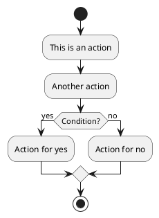
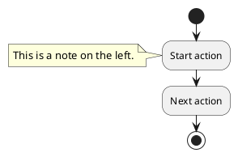
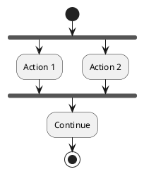
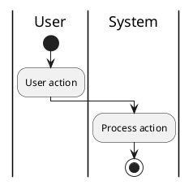
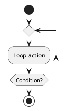
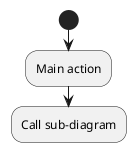

# PlantUML Activity Diagram Syntax Guide

PlantUML allows you to create activity diagrams using simple text syntax. This guide provides examples of basic syntax and commonly used features.

## Basic Syntax

## Adding Notes

## Parallel Activities

## Swimlanes

## Loops

## Sub-diagrams

## Best Practices

1. **Keep Diagrams Simple**:
   - Avoid overloading diagrams with too many elements. Use sub-diagrams when necessary to break down complexity.

2. **Use Meaningful Names**:
   - Name activities, decisions, and swimlanes descriptively to make the diagram self-explanatory.

3. **Add Notes**:
   - Use notes to provide additional context or explanations for complex parts of the diagram.

4. **Organize with Swimlanes**:
   - Use swimlanes to clearly separate responsibilities between different actors or systems.

5. **Use Consistent Style**:
   - Maintain a consistent naming convention and visual style to improve readability.

6. **Validate Syntax**:
   - Ensure your PlantUML code is free from syntax errors by testing it with a PlantUML renderer.

7. **Document Dependencies**:
   - If the diagram refers to external processes or systems, ensure they are documented elsewhere or linked via sub-diagrams.

## Reference

- [PlantUML Official Documentation](https://plantuml.com/activity-diagram-beta)
- [PlantUML Examples](https://plantuml.com/examples)

This guide demonstrates the basic and advanced syntax for creating activity diagrams in PlantUML. Modify and extend these examples to suit your requirements.
